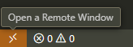
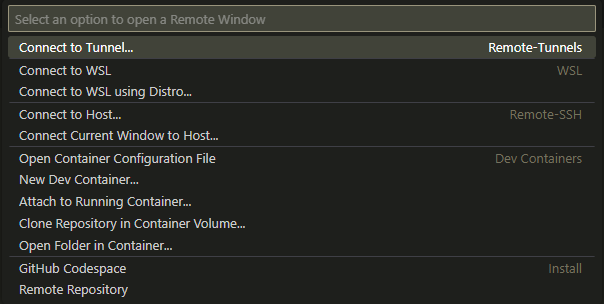
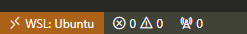

# 🌐 Live-Server_SPA

**Live-Server_SPA** is a utility designed to simplify the development of **Single Page Applications (SPA)** by isolating the client-side implementation from the server-side one.  
As a *live server*, it provides **real-time reload** whenever the code is modified.

---

## 🎯 Goals

- 🔹 **Isolate frontend code** → avoid building a new server for every SPA project  
- 🔹 **Server-side rendering** of the frontend code  
- 🔹 **Real-time reload** → every change in the code is instantly reflected in the browser  

---

## ⚡ Features

- 🗂️ **Frontend code injection** → when the utility starts, specify the project directory and the frontend is automatically loaded into the Docker container  
- 🎭 **Server-side rendering** → the internal server handles web app rendering  
- 👀 **File monitoring with inotify** → detects changes in the Linux filesystem  
- 🔄 **Browser reload notifications** → modifications are processed and the web app is reloaded  

---

## 🛠️ Technologies

- 🖧 **Apache** → proxy for request redirection  
- 💻 **C++** → used to build the server and monitor filesystem changes  
- 📦 **Docker** → runs the entire application  
- 🐚 **Bash scripts** → used for application startup and frontend directory loading  

---

## 📋 Requirements

Before running the app, make sure you have:

- 🐧 **Linux OS or WSL**  
  > The utility relies on the Linux `inotify` syscall, so both the utility **and your IDE** must run on Linux (or WSL on Windows).  
- 🐳 **Docker (with or without Docker Desktop)**  

---

## 💻 Running on Windows

1. Install **WSL** (e.g., Ubuntu).  
2. **Copy your project folder inside WSL**.  
3. Open **VS Code with the WSL extension**:  
   - Install **Remote - WSL** extension  
   - Click the **colored rectangle in the bottom-left corner** → *Connect to WSL*  
   
   
   

4. Once connected, you are fully working inside your Linux subsystem.  
   > Every code change will now be detected in real-time and reloaded by the application 🚀  

---

## 📜 License

Distributed under the **MIT License**.  
See the [`LICENSE`](./LICENSE) file for details.

