# 🌐 Live-Server_SPA Documentation

## 1. Actors
As shown in the *Use Case Diagram*, the application involves 4 main actors:  

- **Dev**  
- **IDE**  
- **Browser**  
- **FileSystem**  

  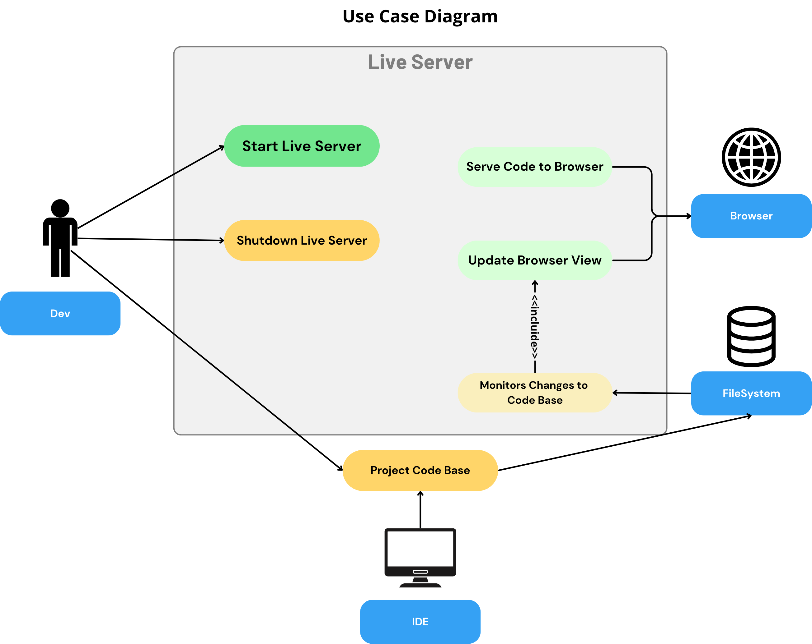

<em>Figure 1 – Use Case Diagram for Live Server SPA</em>

---

## 2. Requirements
The system must satisfy the following requirements:  

- **Start and stop the Live Server**  
- **Serve code to the browser** using *server-side rendering* (SSR)  
- **Monitor changes in the codebase**  
- **Reload the browser page whenever changes are detected**  
- **Keep the codebase independent from the Live Server**  

---

## 3. Activity Diagrams

### 3.1 Live Server Startup
The first diagram describes the startup of the Live Server from the **Dev** perspective.  

  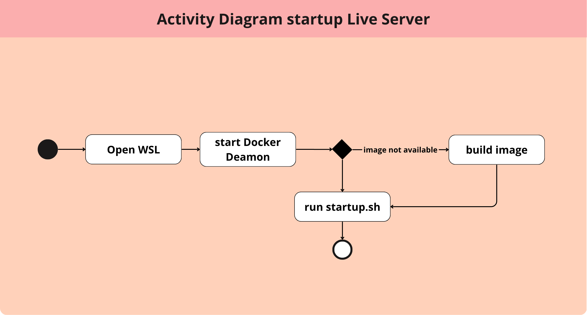

<em>Figure 2 – Activity Diagram Startup</em>

---

### 3.2 Live Server Running
The second diagram shows the Live Server operation once running.  

It includes three **swimlanes**:  
- **Windows (Host OS)** – used to open the browser  
- **WSL** – hosts the IDE and filesystem  
- **Docker** – runs an Apache container (configured as a reverse proxy) forwarding requests to the C++ server for SSR  

  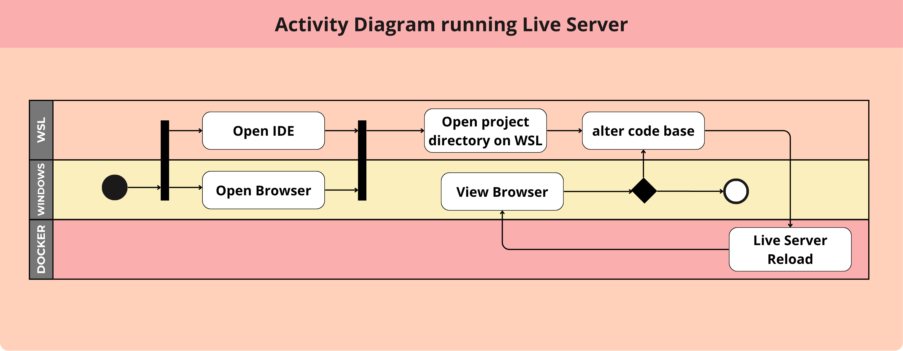

<em>Figure 3 – Activity Diagram Running</em>

---

## 4. Project Structure
The application is composed of **WSL**, **Windows**, and **Docker**.  

- **Docker**: runs Apache as a reverse proxy, forwarding requests to the C++ server. A *docker volume* ensures Apache always serves the latest codebase version.  
- **WSL**: contains scripts to start/stop the app, the IDE, and the filesystem.  
- **inotify (Linux syscall)**: detects file changes in real time and communicates them to the backend.  

  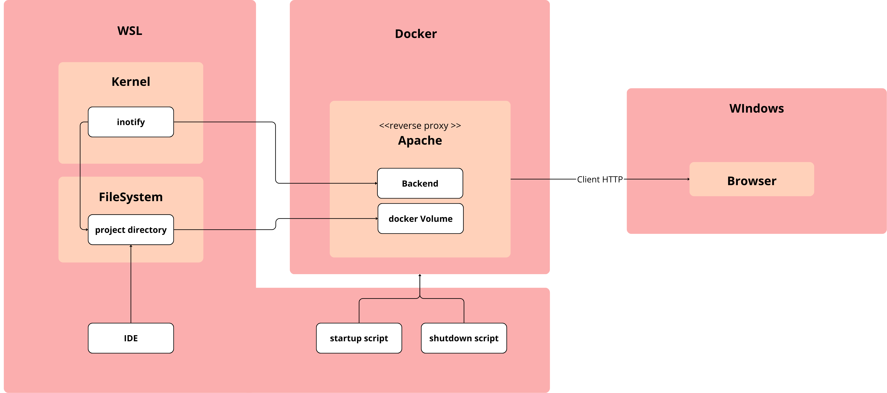

<em>Figure 4 – Class Diagram</em>

---

## 5. Watcher
The **Watcher** class communicates with the `inotify` syscall.  
It depends only on **events_register**, which keeps track of the codebase update state.  

- **Constructor**  

  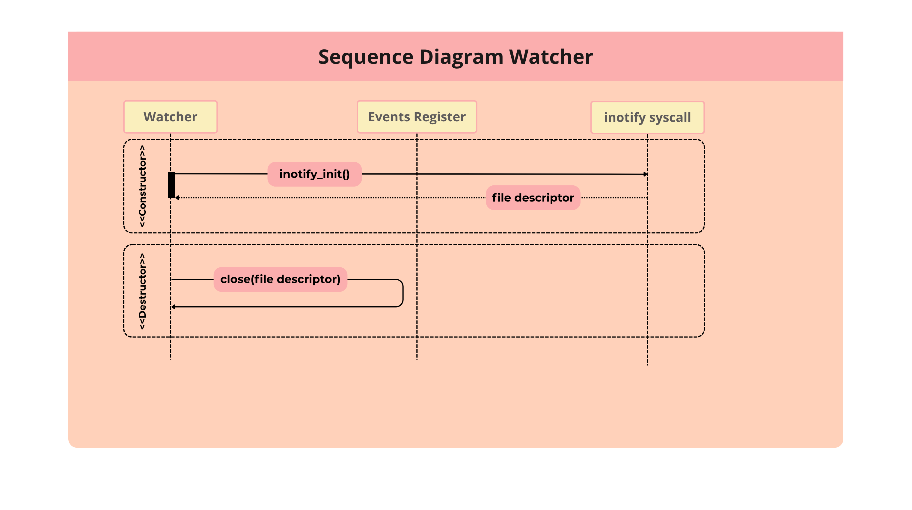

<em>Figure 5 – Sequence Diagram Watcher (Constructor)</em>

- **Recursive watcher setup**  
The method `add_watcher_recursive()` monitors the parent directory and all its subdirectories.  

  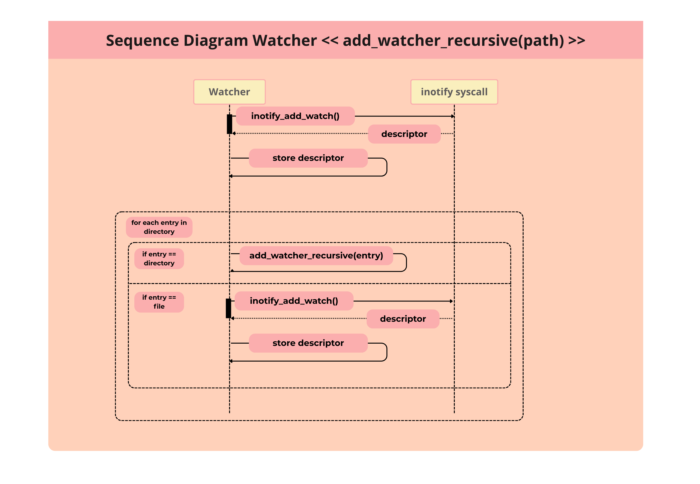

<em>Figure 6 – Sequence Diagram Watcher add_watcher_recursive()</em>

- **Monitoring changes**  
The `watch()` method uses the blocking `read()` function to capture events, which are then registered with `add_event()`.  

  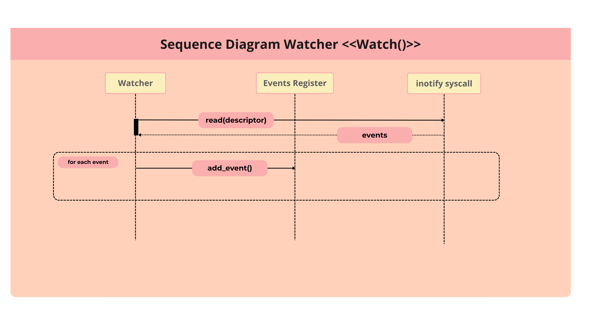

<em>Figure 7 – Sequence Diagram Watcher watch()</em>

---

## 6. Server
The **Server** has two main purposes:  

1. **Notify changes to the browser** using **Server-Sent Events (SSE)**  
2. **Perform Server-Side Rendering (SSR)**: Apache intercepts requests and forwards them to the C++ backend  

To keep the **codebase independent from the Live Server**, an endpoint injects runtime JavaScript that initializes the SSE connection in the browser.  

  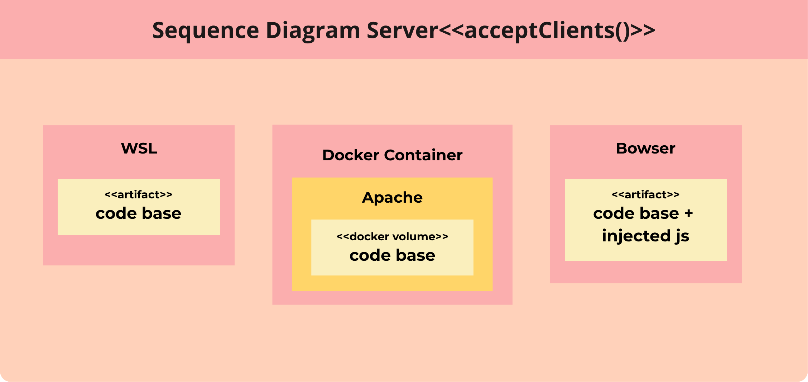

<em>Figure 8 – Server Artifact</em>

- **Handling client requests**  

  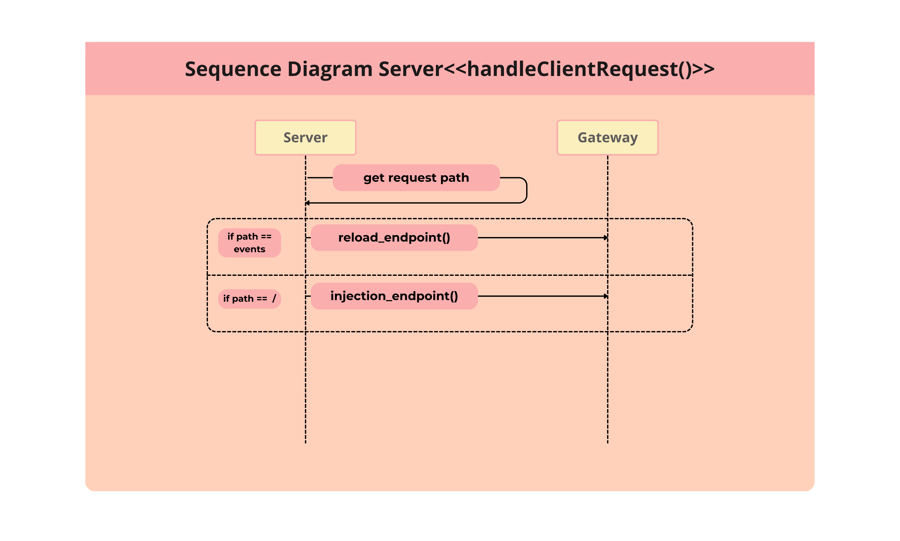

<em>Figure 9 – Sequence Diagram Server handleClientRequest()</em>

- **Accepting clients**  

  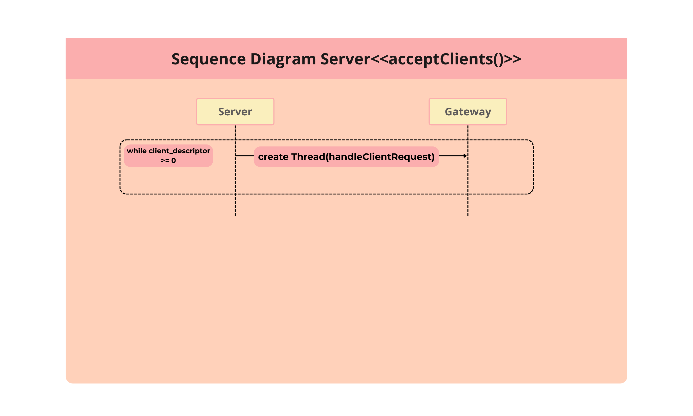

<em>Figure 10 – Sequence Diagram Server acceptClients()</em>

---

## 7. Gateway
The **Gateway** class implements the two main endpoints:  

- **reload_endpoint()**  

  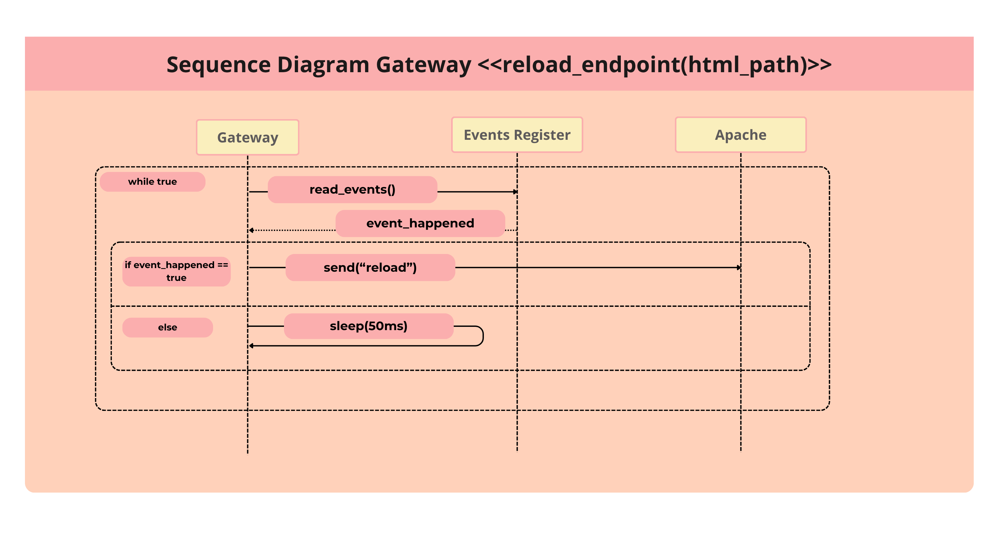

<em>Figure 11 – Sequence Diagram Gateway reload_endpoint()</em>

- **injection_endpoint()**  

  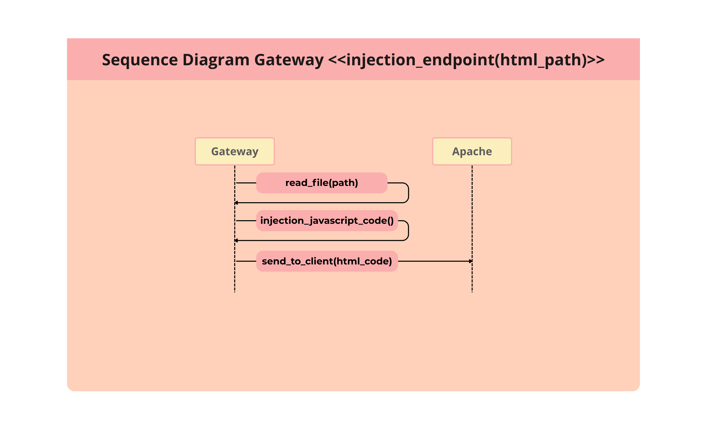

<em>Figure 12 – Sequence Diagram Gateway injection_endpoint()</em>

---

## 8. Main
The **main** program:  
1. Retrieves the path of the *docker volume*  
2. Creates **Server** and **Watcher** instances  
3. Runs both concurrently  

- `AcceptClients()` spawns a new thread for each client request  
- The parent thread runs the **Watcher**  

  

<em>Figure 13 – Sequence Diagram Main</em>

---

## 9. Concurrency
Finally, the concurrency between **Watcher**, **Gateway**, and **events_register** is represented below:  

  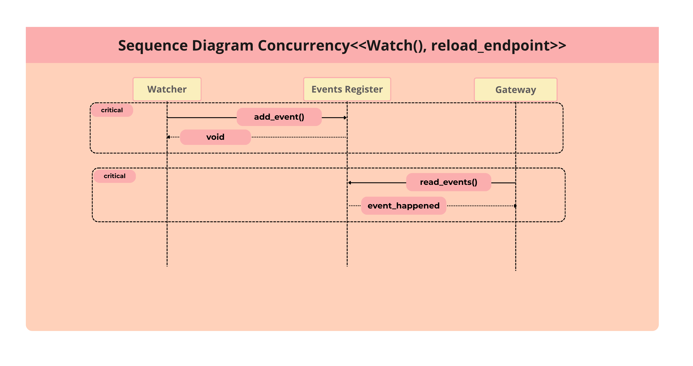

<em>Figure 14 – Sequence Diagram Concurrency</em>

